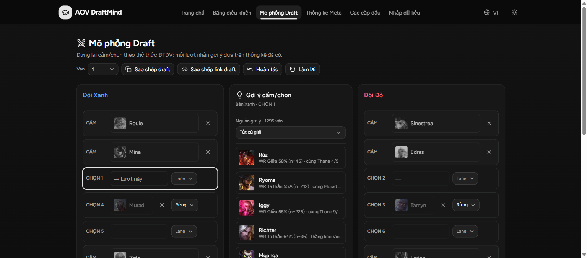
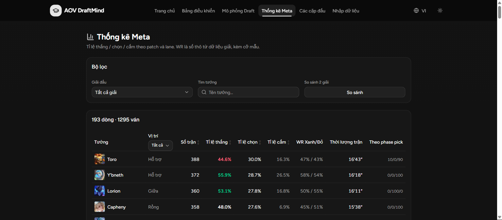
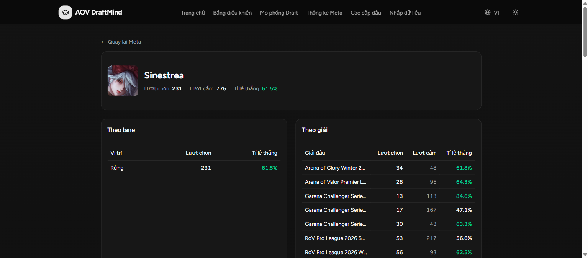

# AOV DraftMind

Trợ lý cấm/chọn (ban/pick) cho **Liên Quân Mobile** — thống kê meta giải đấu, mô phỏng draft và gợi ý dựa trên dữ liệu trận thật import từ [Liquipedia](https://liquipedia.net/arenaofvalor).

**Live:** https://aov-ban-pick.vercel.app



## Tính năng

- **Mô phỏng draft** theo đúng luật giải (8 cấm + 10 chọn), gợi ý ban/pick theo dữ liệu meta, chấm điểm đội hình theo lane/synergy/matchup, kèo đấu từng lane, chia sẻ draft qua URL (`?d=`) và lịch sử draft lưu local.
- **Thống kê meta**: pick/ban rate, winrate theo lane, WR theo bên Xanh/Đỏ, thời lượng thắng trung bình, thống kê theo phase pick (sớm/giữa/muộn), duo theo cặp lane, chế độ so sánh 2 giải/khu vực.
- **Trang tướng** `/heroes/[slug]`: stats theo lane và theo giải (trend), combo đồng đội, kèo thắng/thua, trận gần nhất + VOD.
- **Trang đội** `/teams/[id]`: pool tướng, combo, thành tích theo mùa, head-to-head, series gần nhất.
- **Danh sách trận** `/matches`: lọc theo giải/đội/tướng, link tới trang đội, VOD.
- **Nhập liệu** `/draft-input` + importer Liquipedia (`scripts/import-liquipedia.mjs`) — nguồn data chính của app.
- i18n song ngữ Việt/Anh, dark/light theme.




## Dữ liệu

- Nguồn: **Liquipedia** — tên giải, đội, cấm/chọn, kết quả, thời lượng, VOD.
- Coverage hiện tại: **7 giải/mùa** (AOG, APL, GCS, RPL), **334 series / 1.295 ván / 133 tướng** — xem số liệu sống tại trang `/about` trên site.
- Quy ước pick: trái → phải là `top / jungle / mid / AD / support`; ban giữ đúng thứ tự hiển thị.
- Giới hạn: đây là **meta giải đấu** (không phải meta rank); `pick_index`/`is_counter_pick` là xấp xỉ; thống kê cặp đôi/kèo đấu chỉ hiện khi đủ mẫu tối thiểu.

## Tech stack

Next.js 16 (App Router) · React 19 · TypeScript strict · Tailwind v4 + HeroUI/shadcn · next-intl · Redux Toolkit + SWR · Zod · Vitest — **FE-only, không backend**; dữ liệu là JSON tĩnh trong `public/data/`, mọi tính toán chạy trong browser.

## Phát triển

```bash
npm install
npm run dev          # http://localhost:3000/vi
npm run lint         # eslint — phải sạch
npm test             # vitest
npm run build        # production build
```

Import thêm giải từ Liquipedia:

```bash
node scripts/lp-relay.mjs          # chạy relay trước (bắt buộc — LP chặn fetch trực tiếp)
node scripts/import-liquipedia.mjs # xem --help trong file
npm run validate:data              # kiểm tra toàn bộ dataset sau khi import
```

---

## English

**AOV DraftMind** — a ban/pick assistant for **Arena of Valor**: pro-tournament meta statistics, draft simulation and data-driven suggestions, powered by real match data imported from Liquipedia. Frontend-only Next.js app — all data is static JSON computed in the browser.

Features: draft simulator with suggestions + composition scoring + shareable draft URLs, meta stats (lane WR, blue/red side WR, duration, pick-phase, lane-pair duos, tournament comparison), hero and team profile pages, match browser, and a Liquipedia importer.

Live: https://aov-ban-pick.vercel.app · Data caveats: pro-meta only, pick order is approximate, thin samples are hidden. See `/about` on the site for live coverage numbers.
