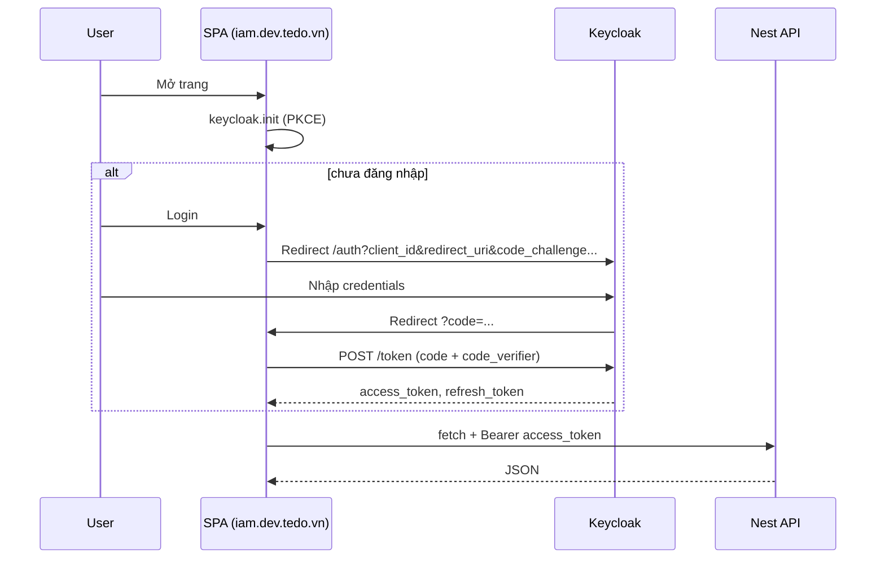

# Hướng dẫn: FE (`tedo-keycloak`) gọi API + cấu hình Keycloak / backend

Tài liệu mô tả **luồng OIDC theo mã `tedo-containers/tedo-keycloak`**, **endpoint Keycloak / Nest**, **gửi–nhận gì**, cùng **CORS / deploy** khi SPA và API khác origin.

---

## 1. Luồng hoạt động (theo mã `tedo-keycloak`)

### 1.1. File tham chiếu

| File | Vai trò |
|------|---------|
| `tedo-keycloak/src/ui/keycloak.ts` | Tạo singleton `keycloak-js`: `new Keycloak({ url, realm, clientId })` từ `VITE_KEYCLOAK_URL`, `VITE_KEYCLOAK_REALM`, `VITE_KEYCLOAK_CLIENT_ID`. |
| `tedo-keycloak/src/ui/App.tsx` | `keycloak.init`, `login` / `logout`, giữ `token`, helper `api()` gọi Nest bằng `fetch`. |

`KEYCLOAK_URL` trong Docker (K8s) thay placeholder build-time; local dùng `.env` → `VITE_*`.

### 1.2. Chuỗi bước (người dùng → trình duyệt)

1. User mở SPA (vd. `https://iam.dev.tedo.vn`).
2. **`keycloak.init({ pkceMethod: "S256", checkLoginIframe: false, redirectUri: window.location.origin })`**  
   - Nếu URL **không** có `code` (lần đầu): thư viện kiểm tra phiên (silent / chưa đăng nhập) → thường `authenticated === false`.  
   - Nếu Keycloak **redirect về** SPA kèm `?code=...&session_state=...`: thư viện **POST token endpoint** (PKCE), lấy **access token** + refresh token, gán `keycloak.token`, `keycloak.tokenParsed`.
3. User bấm **Login** → **`keycloak.login({ redirectUri: window.location.origin })`** → trình duyệt **chuyển hướng** tới **Authorization endpoint** Keycloak (full page, không phải `fetch` CORS thông thường từ SPA).
4. User nhập user/pass tại Keycloak → Keycloak redirect về `redirectUri` kèm `code`.
5. Bước 2 lặp lại: đổi `code` → token.
6. **`setInterval` 30s** gọi **`keycloak.updateToken(30)`**: nếu access token sắp hết hạn, thư viện gọi **Token endpoint** với `grant_type=refresh_token`.
7. Mọi gọi REST tới Nest: **`fetch(apiBase + path, { headers: { Authorization: "Bearer " + token } })`** — xem mục 3.



---

## 2. Endpoint OIDC phía Keycloak (server `{KEYCLOAK_URL}`, realm `{realm}`)

`{KEYCLOAK_URL}` = giá trị `VITE_KEYCLOAK_URL` (vd. `https://keycloak.dev.tedo.vn`, **không** có `/realms/...` ở cuối).  
`{realm}` = `VITE_KEYCLOAK_REALM` (vd. `tedo`).

Các URL dưới đây là **chuẩn Keycloak OpenID Connect**; `keycloak-js` gọi chúng **nội bộ** (redirect + `fetch`/`XHR` tùy phiên bản), **không** viết tay trong `App.tsx`.

| Bước | Endpoint (path trên server Keycloak) | Phương thức / hành vi | Gửi (tóm tắt) | Trả về |
|------|----------------------------------------|------------------------|---------------|--------|
| **Discovery** | `/realms/{realm}/.well-known/openid-configuration` | `GET` | — | JSON: `authorization_endpoint`, `token_endpoint`, `jwks_uri`, `end_session_endpoint`, … |
| **Authorization** | `/realms/{realm}/protocol/openid-connect/auth` | Redirect trình duyệt `GET` | Query: `client_id`, `redirect_uri`, `response_type=code`, `scope` (vd. `openid profile email`), `state`, PKCE `code_challenge`, `code_challenge_method=S256` | Trang đăng nhập Keycloak; sau khi OK → **302** về `redirect_uri?code=...&session_state=...` |
| **Token (code)** | `/realms/{realm}/protocol/openid-connect/token` | `POST` `application/x-www-form-urlencoded` | `grant_type=authorization_code`, `code`, `redirect_uri`, `client_id`, `code_verifier` (PKCE) | JSON: `access_token`, `refresh_token`, `expires_in`, `id_token` (nếu scope có openid), … |
| **Token (refresh)** | Cùng `/token` | `POST` | `grant_type=refresh_token`, `refresh_token`, `client_id` | JSON access token mới (và có thể refresh token mới) |
| **Logout** | `/realms/{realm}/protocol/openid-connect/logout` | Redirect (theo cấu hình client) | `client_id`, `post_logout_redirect_uri`, `id_token_hint` (tuỳ phiên bản) | Redirect về SPA sau khi hủy phiên |
| **JWKS** | `/realms/{realm}/protocol/openid-connect/certs` | `GET` | — | JSON public keys (API Nest dùng JWKS tương tự để verify JWT) |
| **UserInfo** (tuỳ cấu hình / thư viện) | `/realms/{realm}/protocol/openid-connect/userinfo` | `GET`/`POST` + Bearer access token | — | JSON claims user |

**Access token** (chuỗi JWT) là thứ SPA gắn vào header **`Authorization: Bearer ...`** khi gọi Nest. Payload thường có `sub`, `preferred_username`, `realm_access.roles`, `aud`, `exp`, `iss`, …

---

## 3. Fetch tới Nest API (trong `App.tsx` — helper `api`)

`apiBase` = `import.meta.env.VITE_API_BASE_URL` (vd. `https://api.tedo.vn/api`). **Phải kết thúc bằng `/api`** (global prefix Nest).

```ts
// Rút gọn từ App.tsx
const res = await fetch(`${apiBase}${path}`, {
  method,
  headers: {
    "Content-Type": "application/json",
    ...(token ? { Authorization: `Bearer ${token}` } : {}),
  },
  body: body !== undefined ? JSON.stringify(body) : undefined,
})
const data = await res.json().catch(() => ({}))
// { ok: res.ok, status: res.status, data }
```

| Thành phần | Gửi | Nhận |
|------------|-----|------|
| **Request** | `method` (GET/POST/PUT/DELETE), path suffix (vd. `/roles`, `/users?max=50`), header `Authorization` nếu đã login, `Content-Type: application/json`, body JSON cho POST/PUT/DELETE | — |
| **Response** | — | HTTP status; body JSON Nest (thành công hoặc `{ message, statusCode, error }` khi 4xx/5xx). SPA đọc `res.ok`, `data`. |

**Lưu ý:** Đây là **cross-origin** (SPA origin ≠ `api.tedo.vn`). Trình duyệt sẽ gửi **preflight OPTIONS** nếu cần; Ingress API phải CORS đúng (mục 6).

### 3.1. Các path Nest mà SPA demo gọi (suffix sau `apiBase`)

| Tab / chức năng | Ví dụ method + path | Auth header | Ghi chả |
|------------------|---------------------|-------------|---------|
| Auth | `GET /auth/public` | Không | Public |
| Auth | `GET /auth/protected`, `/auth/me`, `/auth/admin-only` | Bearer | `admin-only` cần role ADMIN trong token |
| Users | `GET /users?...`, `POST /users`, `PUT/DELETE /users/:id`, roles, password | Bearer + ADMIN | Query có `max`, `search`, … (DTO đã validate) |
| Roles | `GET /roles`, `POST /roles` | Bearer + ADMIN | |
| Permissions | `GET /permissions/me`, CRUD resources/scopes/policies/permissions | Bearer; admin cho phần quản trị | |

Chi tiết đủ route: `tedo-containers/src/features/keycloak-app/*.controller.ts`.

---

## 4. Ai xử lý redirect đăng nhập?

| Thành phần | Redirect OAuth? | Ghi chú |
|------------|-------------------|---------|
| **Keycloak** | **Có** | Login / logout / code flow. |
| **API Nest** | **Không** (mặc định) | Chỉ JWT Bearer. |
| **SPA** | `login` / `logout` với `redirectUri` | Phải khớp *Valid redirect URIs* / *post logout* trong Keycloak. |

---

## 5. Cấu hình Keycloak (bắt buộc cho FE)

Client **public** trong realm `tedo`, trùng `VITE_KEYCLOAK_CLIENT_ID` (vd. `tedo-frontend`).

- **Valid redirect URIs**: vd. `https://iam.dev.tedo.vn/*`, `http://localhost:5174/*`
- **Valid post logout redirect URIs**: tương tự nếu dùng `logout({ redirectUri })`
- **Web origins**: `https://iam.dev.tedo.vn`, localhost nếu cần
- **Standard flow** + **PKCE** (đã bật trong `init`)
- **Audience token**: API Nest thường cấu hình `KEYCLOAK_AUDIENCE` (vd. `tedo-api,account`) — xem triển khai `tedo-api` / Terraform.

---

## 6. Bổ sung fetch: `credentials` và CORS

- Demo hiện **không** set `credentials: "include"`; chỉ cần Bearer.
- Nếu sau này bật cookie session trên API + `credentials: "include"`, Ingress phải `Access-Control-Allow-Credentials: true` và **origin cụ thể** (template Terraform đã có cho origin SPA).

---

## 7. Backend / Ingress — CORS cho API

File: `terraform/do/modules/kubernetes/tedo_api_resources_networking.tf`.

- `enable-cors`, `cors-allow-origin` (vd. `https://iam.dev.tedo.vn`), `cors-allow-credentials`, `cors-allow-headers` gồm **`Authorization`**.

**API không** khai báo redirect URI OAuth.

---

## 8. Biến môi trường SPA (build & runtime)

| Nguồn | Biến | Ý nghĩa |
|--------|------|---------|
| Vite | `VITE_KEYCLOAK_URL`, `VITE_KEYCLOAK_REALM`, `VITE_KEYCLOAK_CLIENT_ID` | Cấu hình `keycloak-js` |
| Vite | `VITE_API_BASE_URL` | Base Nest (có `/api`) |
| K8s container | `KEYCLOAK_*`, `API_BASE_URL` | Inject qua `docker-entrypoint.sh` |

---

## 9. Kiểm tra nhanh

1. SPA login không lỗi `invalid_redirect_uri`.
2. Network: request API có `Authorization: Bearer ...`.
3. Không lỗi CORS.
4. `GET .../api/auth/protected` → 200 với token hợp lệ.

---

## 10. Deploy (`tedo-k8s`) — tóm tắt

Build & push `tedo-api`, `tedo-keycloak`; `terraform plan/apply` với `env/dev.tfvars`; DNS + TLS. Chi tiết: `.github/workflows/deploy-dev.yml`.

---

## 11. Danh sách API IAM (Nest — `KeycloakAppFeatureModule`)

Prefix: **`/api`**. Path trong bảnh dưới là **suffix** sau `VITE_API_BASE_URL`.

### Auth (`/auth`)

| Method | Path | Auth |
|--------|------|------|
| GET | `/auth/public` | Không |
| GET | `/auth/protected`, `/auth/me` | Bearer |
| GET | `/auth/admin-only` | Bearer + `ADMIN` |

### Users, Roles, Permissions, Debug

Như mục 3.1; code: `src/features/keycloak-app/`. Swagger/Scalar: `apps/api/src/main.ts`.

---

## 12. Source & build `tedo-keycloak`

Repo **`tedo-containers`**, thư mục `tedo-keycloak/`.

```bash
cd tedo-containers/tedo-keycloak
npm ci && npm run build
```

Image: `tedo-keycloak/Dockerfile`.
